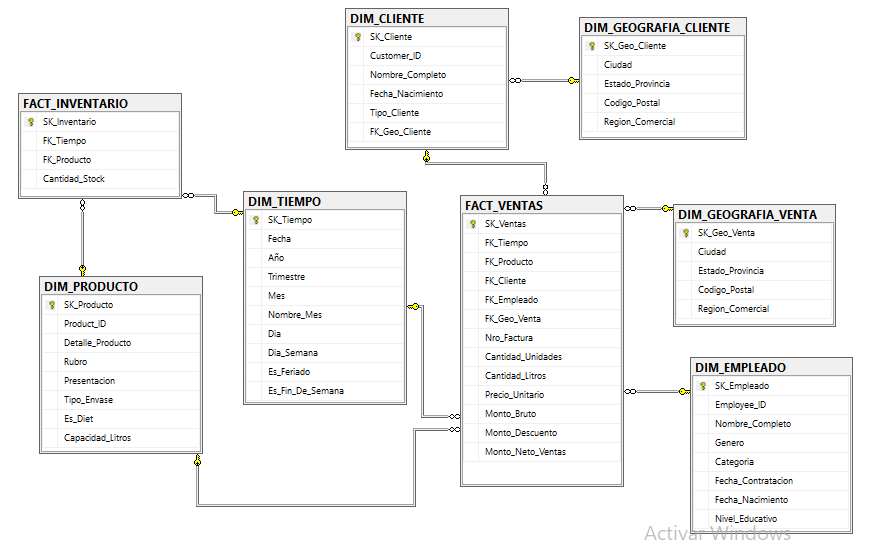
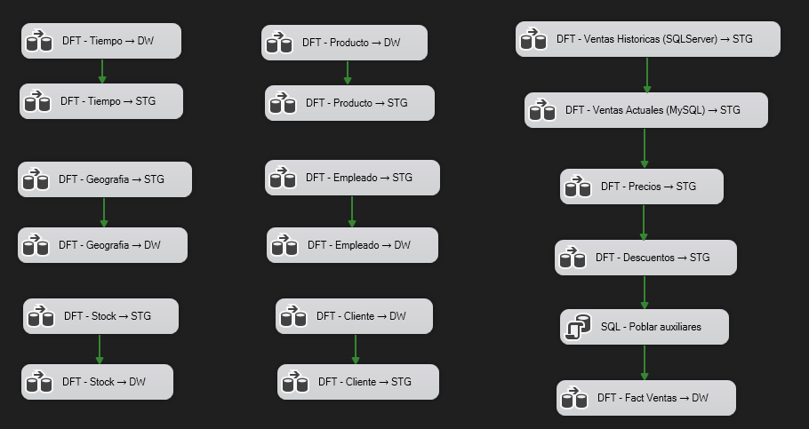
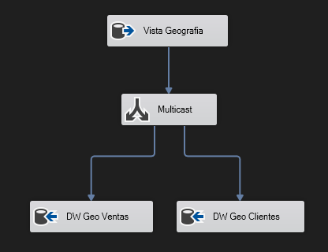
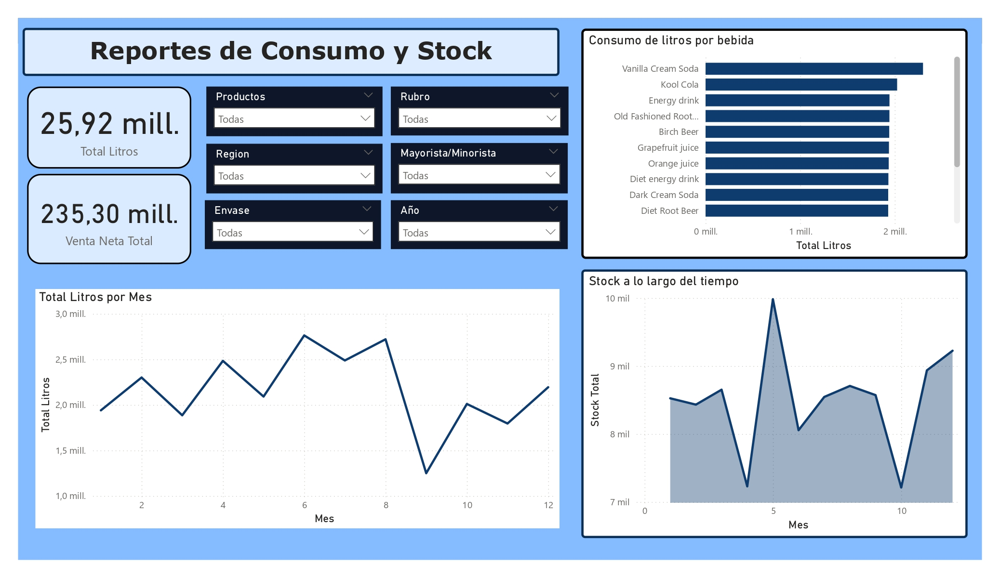

# TDC Data Warehouse — Pipeline de BI de punta a punta

Solución completa de Business Intelligence para **The Drinking Company (TDC)**, empresa distribuidora de bebidas que opera en 4 regiones de Estados Unidos. El proyecto integra datos de múltiples fuentes heterogéneas en un modelo dimensional y entrega un dashboard interactivo en Power BI para el análisis comercial y operativo de la compañía.

## Stack tecnológico

| Capa | Tecnología |
|---|---|
| Orquestación y carga | Microsoft SSIS (Visual Studio) |
| Transformación | SQL Server — Vistas T-SQL |
| Data Warehouse | SQL Server — Esquema dimensional |
| Fuente histórica | SQL Server 2000 (ventas hasta 2008) |
| Fuente actual | MySQL vía ODBC (ventas desde 2009) |
| Fuentes de archivos planos | TXT, XLS, XML |
| Visualización | Microsoft Power BI |

## Arquitectura

El pipeline sigue un enfoque **ELT estricto**: SSIS se encarga exclusivamente de extraer y cargar datos crudos (forzando encoding Unicode mediante Data Conversion), mientras que toda la lógica de negocio reside en vistas T-SQL dentro de la capa de Staging. Un segundo paso de SSIS lee las vistas transformadas y puebla el Data Warehouse.

```
[SQL Server histórico]   ─┐
[MySQL actual]            ├──▶  TDC_Staging  ──▶  TDC_DataWarehouse  ──▶  Power BI
[TXT / XLS / XML]        ─┘   (tablas brutas       (modelo estrella,
                                + vistas SQL)        dims + facts)
```

**Desafíos técnicos resueltos:**
- **Resolución de precio vigente:** cada línea de venta se cruza contra el historial de precios para encontrar el precio más reciente sin superar la fecha de la transacción
- **Mejor descuento aplicable:** evaluación de condiciones múltiples (período de vigencia + umbral de monto por factura) con selección del mayor porcentaje entre descuentos solapados
- **Geografía de rol duplicado:** dos tablas físicamente independientes (`DIM_GEOGRAFIA_VENTA` y `DIM_GEOGRAFIA_CLIENTE`) para evitar relaciones ambiguas en Power BI causadas por el doble camino entre `FACT_VENTAS` y una única tabla de geografía compartida
- **Filas comodín (SK = -1):** en todas las dimensiones opcionales para preservar integridad referencial sin descartar registros con datos no resolubles

## Modelo Dimensional



El modelo está compuesto por **2 tablas de hechos** y **6 dimensiones**:

- **`FACT_VENTAS`** — granularidad: una línea de producto por factura (~1.6M filas, Feb 2006 – Ago 2009). Incluye precio unitario vigente, monto bruto de factura, mejor descuento aplicable y monto neto de ventas.
- **`FACT_INVENTARIO`** — granularidad: foto diaria de stock por producto (993 filas, Ene 2002 – Dic 2004, fuente: sistema MRP).

> **Nota:** Las ventanas temporales de ambas facts no se superponen — esto es una limitación inherente a las fuentes de datos originales, no un error del pipeline.

## ETL / SSIS



La carga de geografía ilustra el patrón **Multicast** utilizado para poblar dos dimensiones independientes en un único paso de lectura:



## Dashboard


El reporte de Power BI ofrece una vista panorámica del consumo y el stock de la compañía. Seis segmentadores (Producto, Rubro, Región, Tipo de Cliente, Envase, Año) filtran dinámicamente todos los visuales. El modelo permite responder preguntas como:

- Top 10 de productos por volumen de litros, segmentado por región geográfica
- Tendencias de consumo mensual y patrones de estacionalidad
- Evolución comparada de bebidas diet vs. no diet y lata vs. botella
- Niveles de stock por categoría de producto a lo largo del tiempo

El archivo interactivo se encuentra en `/dashboard`.

## Estructura del repositorio

```
├── sql/
│   ├── 01_dw_create_tables.sql      # DDL completo del Data Warehouse (dims + facts)
│   ├── 02_staging_views.sql         # Vistas de transformación ELT (lógica de negocio)
│   └── 03_staging_aux_inserts.sql   # Resolución de precios, montos y descuentos
├── docs/
│   ├── dimensional_model.png        # Diagrama del modelo dimensional
│   ├── ssis_control_flow.png        # Vista general del paquete SSIS
│   ├── ssis_geography_dataflow.png  # Data Flow con componente Multicast
│   └── dashboard_preview.png        # Preview del dashboard de Power BI
└── dashboard/
    └── TDC_ConsumoDashboard.pbix
```

## Notas sobre los datos

- Los datos de ventas cubren **Feb 2006 – Ago 2009** (SQL Server histórico hasta 2008, MySQL desde Ene 2009)
- Los datos de inventario cubren **Ene 2002 – Dic 2004** (sin superposición temporal con las ventas)
- 20 clientes (2,86% del volumen de ventas, 47.004 filas) no pudieron resolverse geográficamente por inconsistencias entre los archivos XML de clientes y el maestro de regiones — se mapean a la fila comodín de la dimensión (SK = -1)
- ~33.000 líneas de venta (2% del total) no tienen precio vigente registrado para su producto en la fecha correspondiente y son descartadas en el INNER JOIN de la vista de transformación
